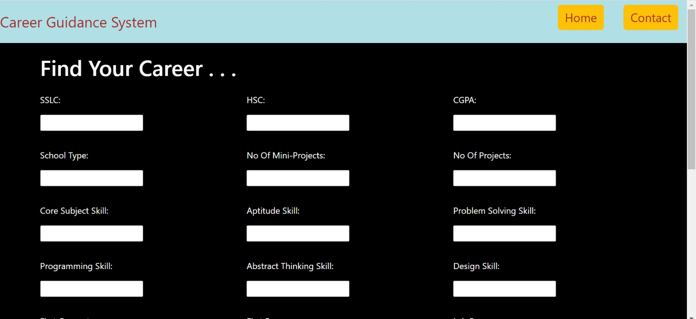
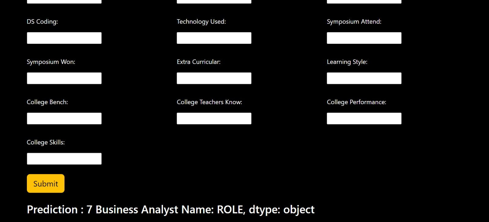
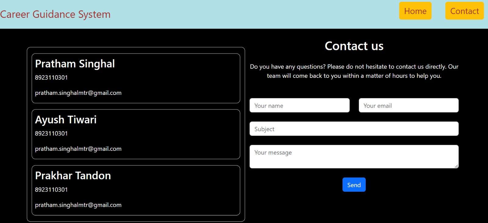

# Career_guidance_system

A career guidance system is a valuable tool designed to assist individuals in making informed and strategic decisions about their professional paths. In today's complex and ever-evolving job market, where numerous career options and specializations are available, having a reliable career guidance system is crucial. This system serves as a compass to help individuals navigate the vast sea of possibilities, taking into account their interests, skills, values, and goals. Whether you're a student exploring potential career choices, a professional seeking a career change, or someone looking to enhance your current career, a well-designed career guidance system can provide invaluable insights and resources to support you in achieving your career aspirations. In this rapidly changing world, where new industries emerge and traditional roles evolve, a career guidance system can be your trusted partner in charting a course to a fulfilling and successful professional future.

## Related-Screenshots

